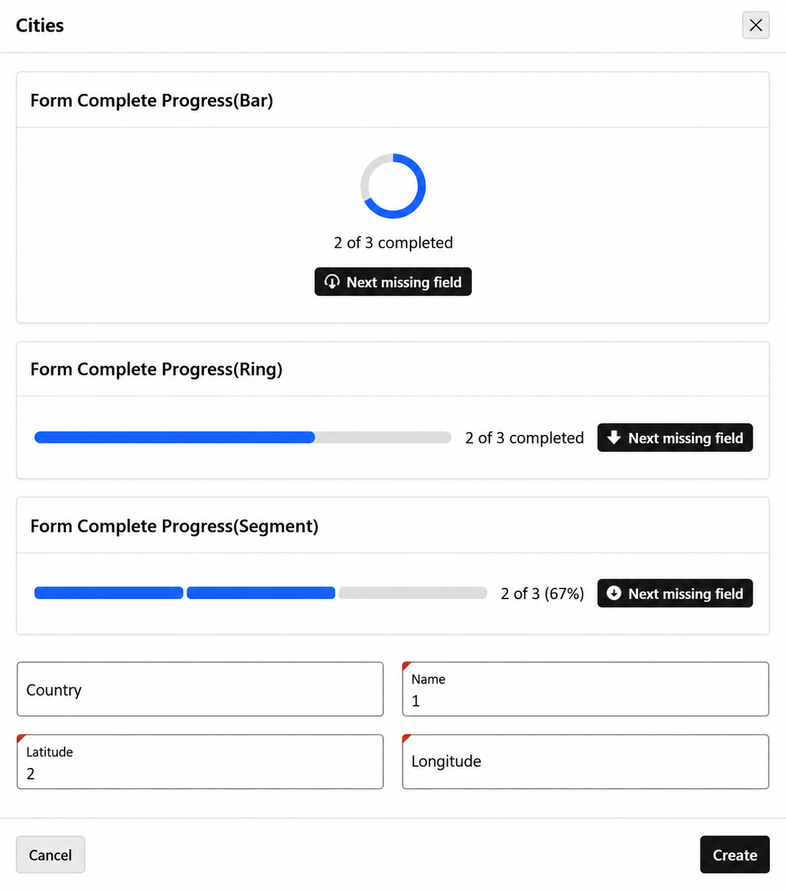

# APEX Form Completion Meter (Progress Bar)

A customizable Oracle APEX **region plug-in** that gives users a clear view of their progress while completing a form. Choose a progress bar, circular ring, or segmented meter, and help users reach the next missing field with an optional jump button.

[Interactive demo](https://cemsm.github.io/Form-Completion-Meter-Progress-Bar/) · [Report an issue](https://github.com/Cemsm/Form-Completion-Meter-Progress-Bar/issues) · [MIT license](LICENSE)

## Features

- **Three display styles:** bar, ring, and segments.
- **Custom appearance:** configurable accent color and a green completed state.
- **Completion tracking:** page or selected-region scope, with configurable count mode.
- **Progress labels:** count-based or percentage display.
- **Jump to missing fields:** configurable button text and icon selected through the APEX Icon Picker.
- **Centered ring layout:** ring, label, and jump button arranged vertically.
- **Optional animations:** pulse and bounce effects, with reduced-motion support.
- **Optional sticky indicator:** a slim progress bar at the top of the page.
- **Universal Theme styling:** the jump button uses APEX Universal Theme classes.

Completion indicates filled fields; it does not replace APEX validation, business rules, or server-side checks.

## Installation

1. Download this repository and locate its plug-in SQL export.
2. In your application, open **Shared Components → Plug-ins → Import**.
3. Import the SQL export and follow the installation wizard.
4. In Page Designer, create a region and select the imported **Form Completion Meter** plug-in as its type.
5. Configure the region attributes, save the page, and run it.

The renderer loads `form-completion-meter.js` and `form-completion-meter.css` from the plug-in's **Files** section. Ensure those files are included in the export or upload them there.

## Configuration

| Attribute | Static ID | Purpose |
|---|---|---|
| Style | `style` | Bar, ring, or segments; default `BAR` |
| Accent Color | `accent` | Progress color; default `#2563eb` |
| Completion Scope | `scope` | Page or region scope; default `PAGE` |
| Scope Region | `scope_region` | Target region when using region scope |
| Count Mode | `count_mode` | Which fields to count; default `REQUIRED` |
| Label Format | `label_format` | Progress label format; default `COUNT` |
| Sticky | `sticky` | Enable the floating indicator; default `N` |
| Animation | `animation` | Progress change effect; default `NONE` |
| Show Jump Button | `show_jump` | Show the missing-field action; default `Y` |
| Jump Button Text | `jump_text` | Default: `Next missing field` |
| Icon | `icon` | Icon attribute; default `fa-arrow-down` |

Configure **Icon** as a component attribute of type **Icon**, with static ID `icon`. The renderer reads it with `l_region.attributes.get_varchar2('icon')` and escapes the value before adding it to the button's class attribute.

## Compatibility

- An Oracle APEX environment supporting the named region attributes used by the renderer.
- Universal Theme / Font APEX for the original plug-in button styling and icons.
- A modern browser supporting CSS custom properties, conic gradients, masks, and `color-mix()`. Smooth percentage interpolation also uses CSS `@property`.

The versions in `apexplugin.json` (`23.26.1.0.0` for Oracle and `26.1.0` for APEX) have been retained from the supplied metadata template. They are **not an independently verified compatibility matrix**. Update them to match the environments in which this plug-in has been tested before publishing a release.

## Interactive demo

Open `index.html` directly in a browser. No build process, external libraries, or backend is needed. Try the display styles, count modes, label formats, colors, animations, icons, sticky mode, and jump button.

The demo is a standalone HTML/CSS/JavaScript recreation of the visible behavior. It does not execute the PL/SQL renderer or the APEX runtime. Its sample form stays in the browser and is not submitted or saved. Filling an email field counts toward completion even if its format is invalid.

### Publish with GitHub Pages

1. Put `index.html` in the repository root on the `main` branch.
2. Open the repository's **Settings → Pages**.
3. Under **Build and deployment**, choose **Deploy from a branch**.
4. Select **main** and **/ (root)**, then save.
5. After deployment, open <https://cemsm.github.io/Form-Completion-Meter-Progress-Bar/>.

## Repository files

| File | Purpose |
|---|---|
| `README.md` | Documentation |
| `apexplugin.json` | Plug-in metadata |
| `index.html` | Standalone interactive demo |
| `screenshots/preview.png` | Screenshot referenced by the README and metadata |
| Plug-in SQL export | Installable APEX plug-in |
| `LICENSE` | MIT license |

Keep the screenshot at `screenshots/preview.png`. The metadata preview URL assumes the default branch is `main`.

## Support

[Open an issue](https://github.com/Cemsm/Form-Completion-Meter-Progress-Bar/issues) with your APEX version, browser, plug-in settings, and steps to reproduce the problem.

## Author

**Mohammad Saleh Moeinadini (Cemsm)**  
[GitHub](https://github.com/Cemsm) · [Email](mailto:cemsm@proton.me)

## License

Released under the [MIT License](LICENSE).
